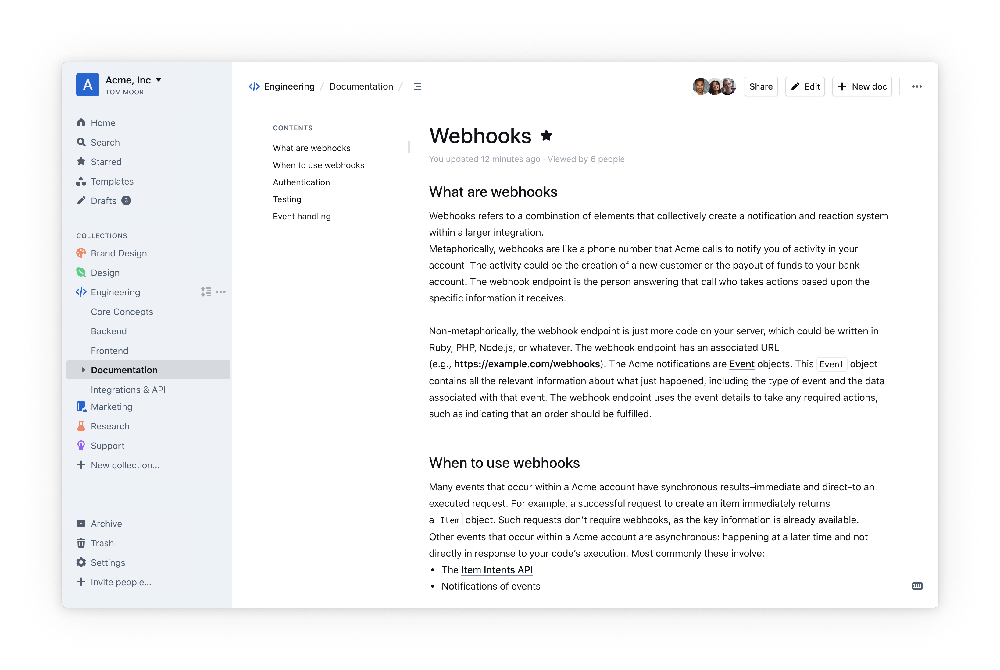
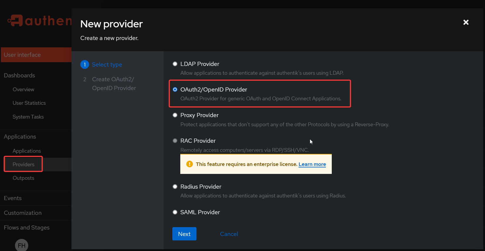
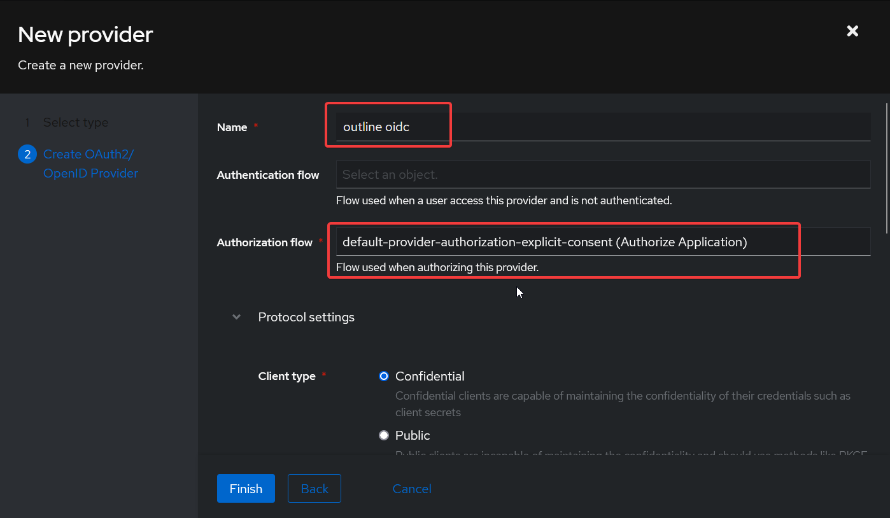
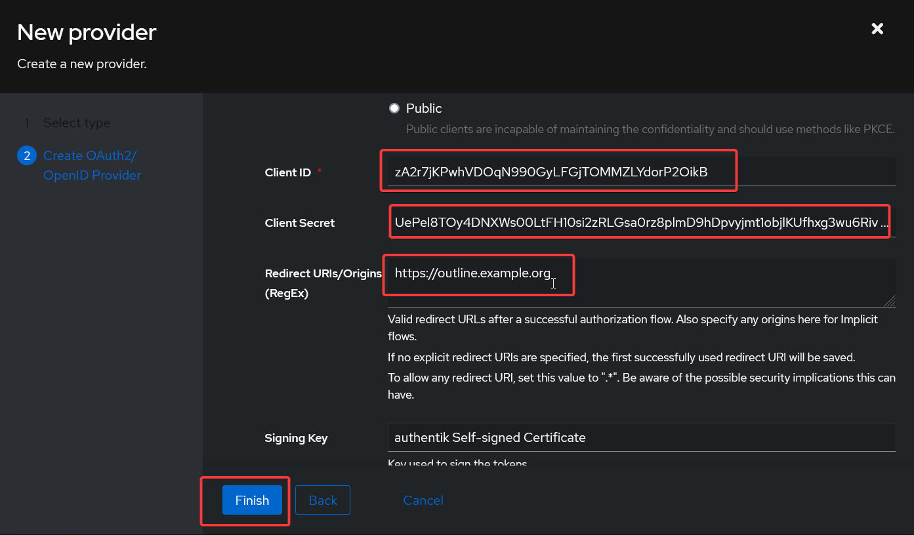
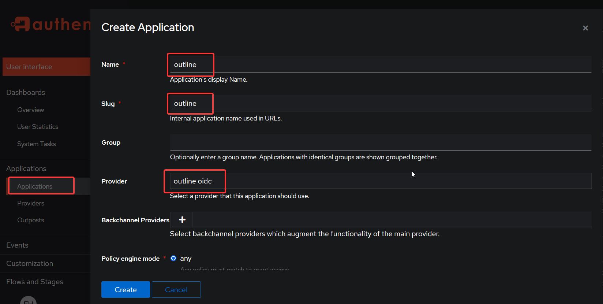
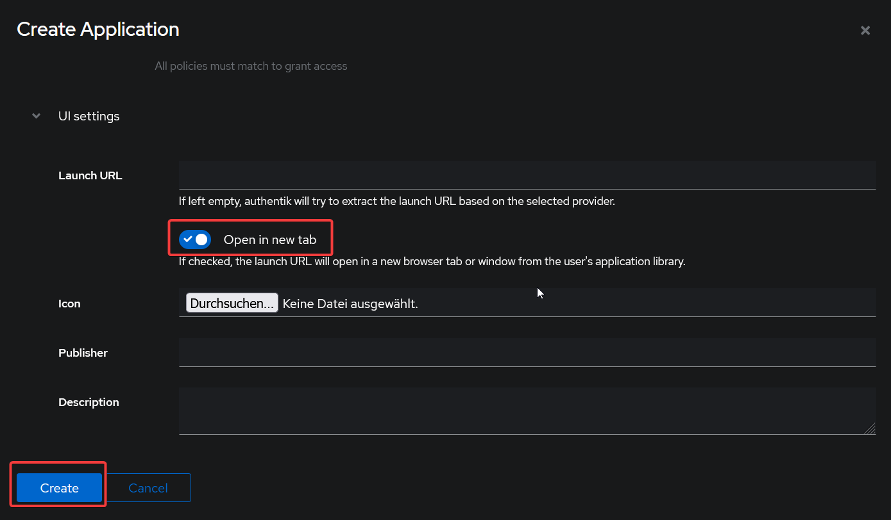
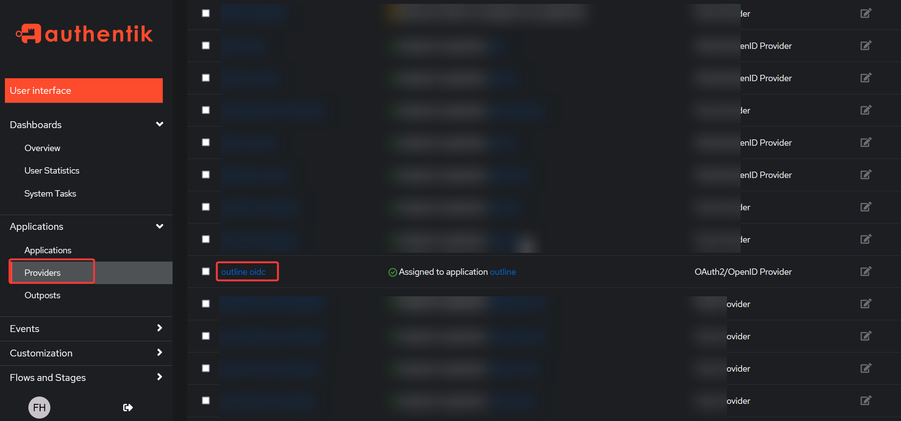
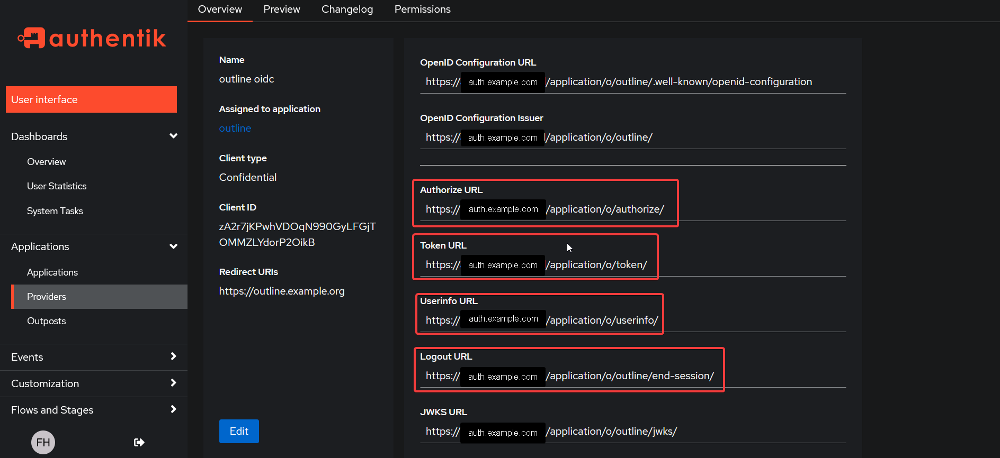

# Outline

OIDC authentification version, without OIDC provider.

_A fast, collaborative, knowledge base for your team built using React and Node.js._

Outline is a full-featured knowledge base and is a great alternative to Notion, Obsidian and other similar apps.

## Features

- Easily host your documents
- Modern UI
- API & Integration support
- Multiple components to choose from when editing documents
- Markdown syntax

Learn more at the official [website](https://getoutline.com)

## Authentik OIDC configuration

Before installing the app in runtipi, follow the steps below in your authentik (or alternative) instance.

